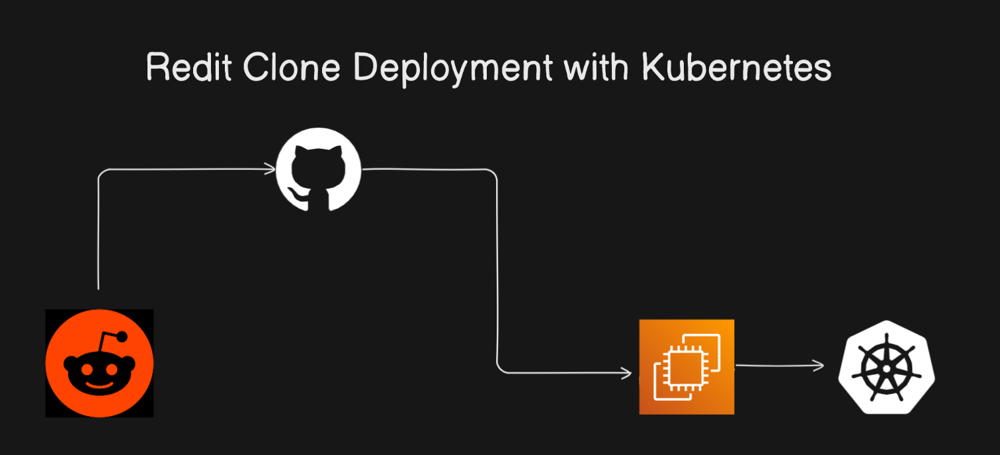

# Reddit Clone Frontend Deployment with Kubernetes

## Architecture Diagram

This project is a **frontend-only clone of Reddit**, focusing on delivering a seamless user interface experience with Nextjs. The deployment is managed on **Kubernetes**, ensuring scalability, reliability, and modern DevOps practices. 

## Overview

The Reddit Clone Frontend is built to simulate the user interface of the popular Reddit platform. This project leverages **Kubernetes** to deploy and scale the application, providing an example of modern frontend deployment techniques using cloud-native technologies.

---

## Features

- **Nextjs Frontend:** Developed with a focus on performance and responsiveness.
- **Kubernetes Deployment:** Modern deployment architecture for high availability and scalability.
- **Declarative Configuration:** Kubernetes manifests define the infrastructure as code.
- **Cloud-Native Solution:** Designed to leverage the full potential of Kubernetes for production-grade performance.

---

## Prerequisites

To deploy the project, ensure you have the following:
1. A Kubernetes cluster (Minikube, GKE, EKS, or AKS).
2. Docker installed to build and push images. [Get Docker](https://www.docker.com/).
3. Helm for managing Kubernetes configurations. [Install Helm](https://helm.sh/docs/intro/install/).
4. kubectl installed and configured for your cluster. [Install kubectl](https://kubernetes.io/docs/tasks/tools/).

---

 
## How to Star the Repository
If you find this project helpful, please star the repository on GitHub to show your support:
1. Click the ⭐ button in the top-right corner.

---

## Author
**Jibran**  
Passionate DevOps Engineer and Software Developer.
Connect with me on [LinkedIn](https://www.linkedin.com/in/muhammad-jibran220/).

---
 

## Feedback & Contributions
Contributions are welcome! Feel free to fork the repository and submit a pull request.

